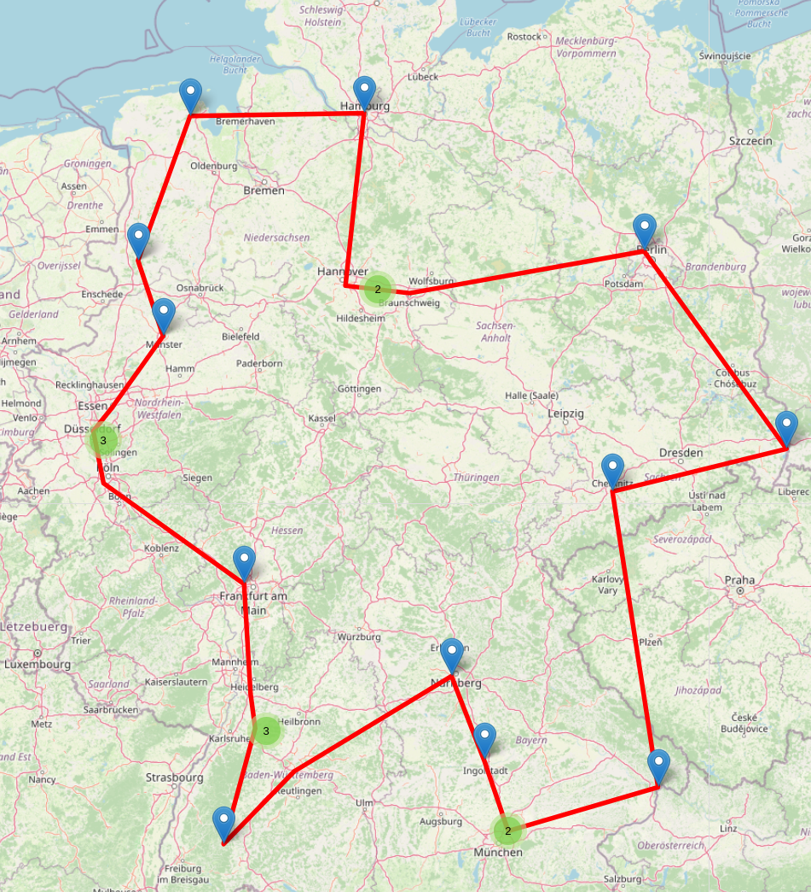

# .msg Coding Challenge

## Ausführung des Codes
Getestet mit Python in einer Virtual Environment mit Python Version 3.8.2 auf Ubuntu 20.04 LTS.

### Installieren der benötigten Packages
```script
$ python setup.py build
$ python setup.py install
$ pip install -r requirements.txt
```
### Ausführen des Codes

```script
$ cd solve_coding_challenge/
$ python main.py -h
usage: main.py [-h] [-l LOAD] [-i ITERATIONS] [-s SCORE]

Import CSV-File and get a solution for the TSP problem. If nothing is set, the
program will set the csv-path to "msg_standorte_deutschland.csv" and the
iterations to 5.

optional arguments:
  -h, --help            show this help message and exit
  -l LOAD, --load LOAD  Load CSV-File in the stated form (default: False)
  -i ITERATIONS, --iterations ITERATIONS
                        Set the wanted iterations with random initial routes
                        for the algorithm (default: False)
  -s SCORE, --score SCORE
                        [OPTIONAL] Set score, where the algorithms ends the
                        optimization. (default: False)

```
### Beispiel
```script
$ python main.py -l /pathtofile/file.csv -i 20
```

## Berechnung der Distanzen
Die Distanz zwischen den Städten wurde mittels der Geokoordinaten als Kreisbogen über 
die Erdkugel berechnet. Somit entspricht die Distanz der "Luftlinie" zwischen den Orten.

## Optimierung des Problems
Zur Optimierung wurde der 2-opt Ansatz gewählt, da dieser einen guten Kompromiss zwischen 
Zeitaufwand und der Minimierung der Gesamtdistanz darstellt.
 


## Lösung/Ergebnisse

### Geringste gefundende Distanz
Die geringste gefundene Distanz in Kilometern beträgt:
 ```script
Distanz: 2333.4124 km
 ```

### Reihenfolge der Standorte
Die Reihenfolge mit Start- und Endpunkt in Ismaning ergibt sich folgendermaßen:

```script
Ismaning/München (Hauptsitz)
Ingolstadt
Nürnberg
Stuttgart
St. Georgen
Bretten
Walldorf
Frankfurt
Köln/Hürth
Düsseldorf
Essen
Münster
Lingen (Ems)
Schortens/Wilhelmshaven
Hamburg
Hannover
Braunschweig
Berlin
Görlitz
Chemnitz
Passau
Ismaning/München (Hauptsitz)
```
### Karte
 |
:----:|
[Link to Interactive Map](solve_coding_challenge/docs/map.html)|